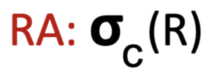

# RDBMS + SQL

## Relational Database Model System

Data Model contains:
- Structure of Data
- Operations on Data
- Constraints
- Types: Relational, Semistructured Data Model, Object-Relational

Relational Model
- Structure = Table
- Operations = Relational Algebra
- Contraints = Typed and can provide limits (value can only be 0-10)

Relation: 2D Table
- Schema = column headers (attribute)
- Instance = rows of data (tuples)
- Degree/Arity = Number of headers in schema
- Cardinality = Number of tuples in data

## Relational Operations

Projection: Choose subset of attributes from a relation
- SELECT A1, A2, A3 FROM R;

Selection: Choose subset of tuplies from a relation
- SELECT * FROM R WHERE C;

Union: Tuples in R or S (or both)
- (SELECT * FROM R) UNION (SELECT * FROM S);

Intersection: Tuples in BOTH R and S
- (SELECT * FROM R) INTERSECT (SELECT * FROM S);
- SELECT name FROM R WHERE name IN (SELECT name FROM S);

Difference: Tuples in R but NOT in S
- (SELECT * FROM R) EXCEPT (SELECT * FROM S);
- SELECT name FROM R WHERE name NOT IN (SELECT name FROM S);

String Matching:
- %, variable length don’t care
- _, single character don’t care
- SELECT ssn FROM student WHERE address LIKE "main%";

Cartesian Product: Pairing each tuple from R to S
- SELECT * FROM R,S
- R X S
- ex. If R has 3 tuples, and S has 2 tuples, the result has 6 tuples

Theta-Join: R X S that satifies condition C
- SELECT * FROM R,S WHERE C;

Natural Join: Pairs of tuples from R and S that agree on common attributes in the schemas
- SELECT R.A, R.B, R.C, S.D FROM R, S WHERE R.B = S.B AND R.C = S.C

Ordering: Order result of tuples by attribute
- ASC is default
- SELECT * FROM R ORDER BY R.A ASC
- SELECT name FROM student ORDER BY name, ssn DESC
    - ssn breaks ties

Disambiguation and Renaming
- Use AS keyword in FROM clause: Students AS Students1 renames Students to Students1
- Use AS keyword in the SELECT clause to rename attributes
- SELECT S1.name, S2.name FROM Students AS S1, Students AS S2 WHERE S1.address = S2.address AND S1.name != S2.name